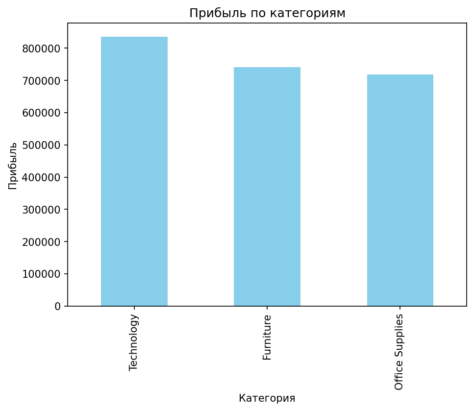
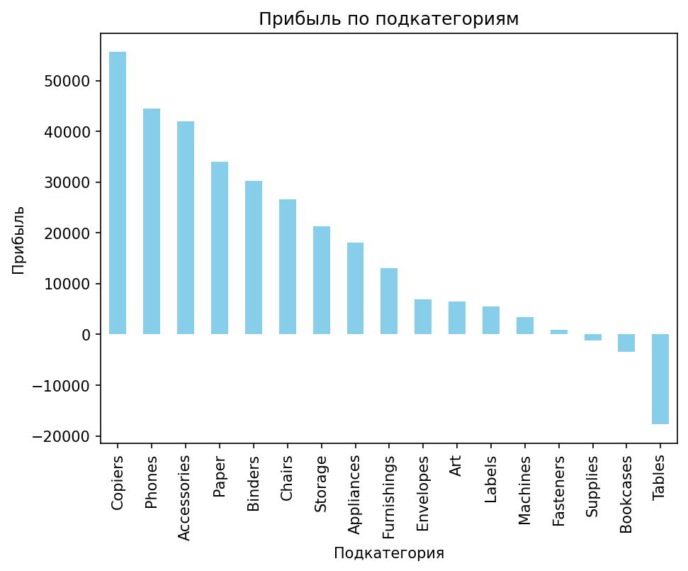
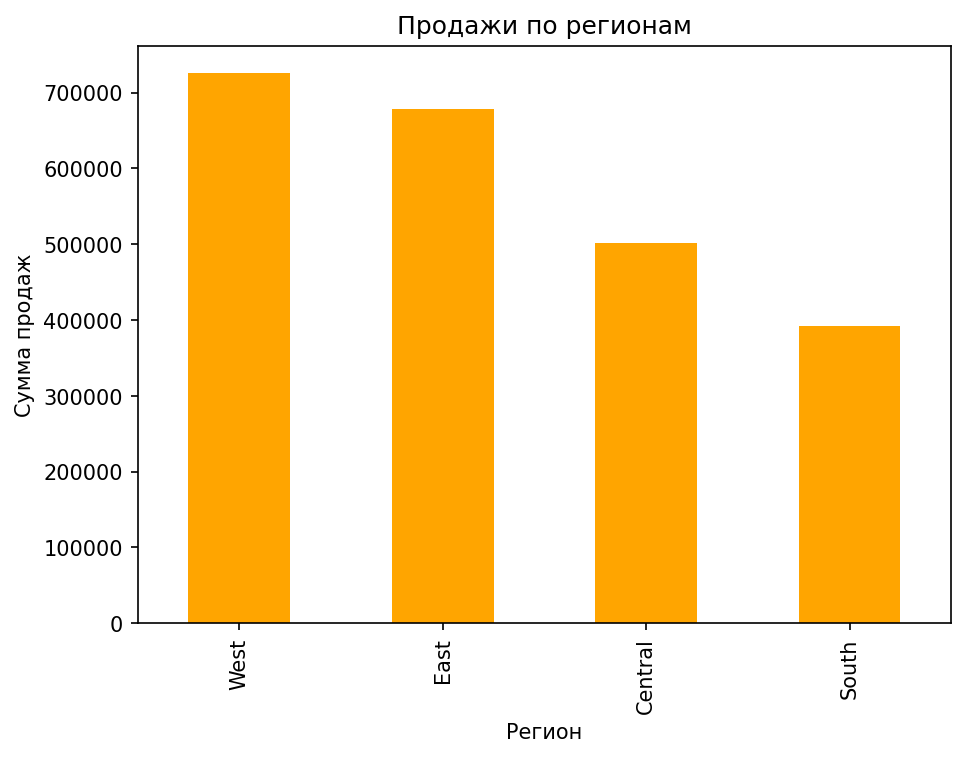
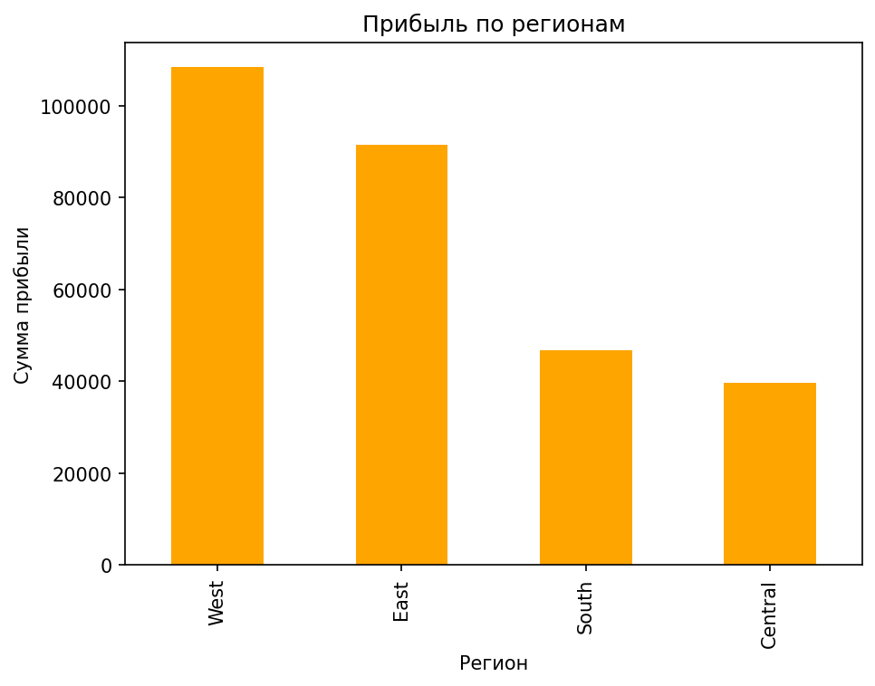
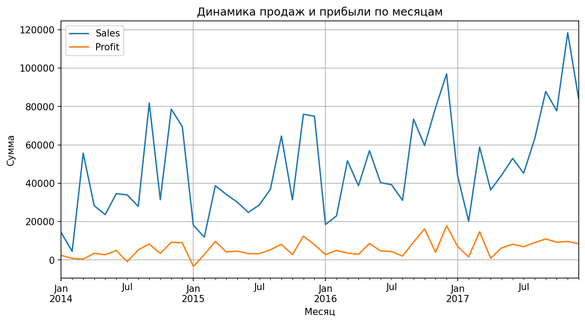

# Анализ данных Superstore  
Автор: Селин Данил  
Дата: 2025-11-18

## 1. Введение  
В этом проекте проводится анализ датасета Superstore, содержащего информацию о продажах, прибыли, товарах, клиентах и регионах.  
Цель анализа:  
- определить ключевые драйверы продаж;  
- выявить убыточные категории и подкатегории;  
- оценить рентабельность бизнеса;  
- понять, какие регионы и сегменты клиентов самые перспективные.
## 2. Описание данных  

Датасет включает 9994 строки и следующие ключевые поля:

- Order Date — дата покупки  
- Category / Sub-Category — товарная категория  
- Sales — выручка  
- Profit — прибыль  
- Quantity — количество товара  
- Discount — скидка  
- Region / State — географическая информация  
- Segment — сегмент клиента  

Период данных: *2014-2017 гг.*

Пропуски: отсутствуют  
Дубликаты: отсутствуют  

## 3. Основные метрики  

Общая выручка:
Выручка: *2 297 200.86 $*

Общая прибыль:
Прибыль: *286 397.02 $*

Рентабельность (Profit Margin):
Рентабельность: *12.47%* 

## 4. Визуализации  

### 4.1. Продажи по категориям
  

Вывод:  
Technology приносят наибольшую выручку, далее Office Supplies, Furniture продаётся хуже всего.
 

### 4.2. Прибыль по категориям
 

Вывод:   
Категория Technology — лидер по прибыли. Furniture и Supplies имеют низкую рентабельность.

### 4.3. Прибыль по подкатегориям
 

Вывод:  
Наибольшие убытки у подкатегории Tables, Bookcases тоже в минусе. Остальные подкатегории прибыльные.

### 4.4. Продажи по регионам
  

Вывод:  
West — самый прибыльный регион, South — самый слабый.

### 4.5. Прибыль по регионам
  

### 4.6. Динамика продаж
  

Вывод:  
Пик продаж — ноябрь-декабрь, минимум — июль, что отражает сезонность.

## 5. Детальный анализ  

### 5.1. Как категории влияют на прибыль?  
- Технологии дают самую высокую прибыль.  
- Мебель проседает из-за подкатегории Tables.  
- Канцтовары стабильные, но не суперприбыльные.

### 5.2. Сезонность  
- Пики продаж: ноябрь–декабрь.  
- Минимум продаж: июль.

### 5.3. Проблемные зоны  
- Tables — сильный убыток  
- Высокие скидки уменьшают прибыль  
- Регион South проседает по продажам

## 6. Итоговые выводы  

1. Продажи и прибыль  
   - Категория Technology — основной драйвер продаж и прибыли.  
   - Furniture и Supplies приносят относительно мало прибыли, в подкатегории Tables фиксируются убытки.

2. География продаж  
   - Регион West — самый прибыльный.  
   - South — слабый регион, стоит обратить внимание на стратегию продаж.

3. Сезонность  
   - Пик продаж — ноябрь–декабрь (праздничный сезон).  
   - Минимум — июль. Можно планировать маркетинговые акции, учитывая сезонность.

4. Рентабельность и скидки  
   - Общая маржа низкая — около 12%.  
   - Сильные скидки негативно влияют на прибыль, необходимо оптимизировать ценовую стратегию.

5. Рекомендации  
   - Пересмотреть подкатегории с отрицательной прибылью (Tables, Bookcases).  
   - Укреплять продажи в слабых регионах.  
   - Сосредоточиться на топовых продуктах из категории Technology и повышать их долю в продажах.  
   - Планировать сезонные маркетинговые активности для повышения выручки в периоды низких продаж.

